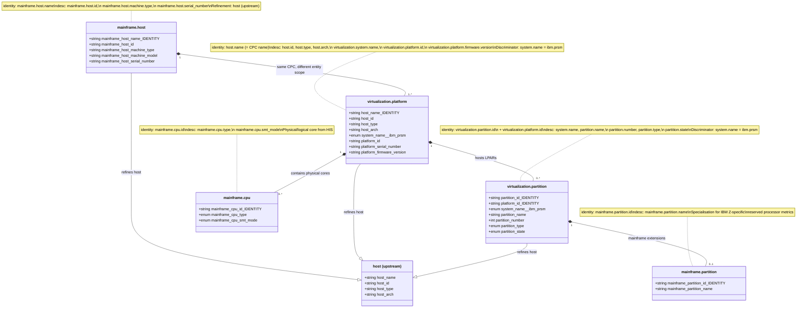
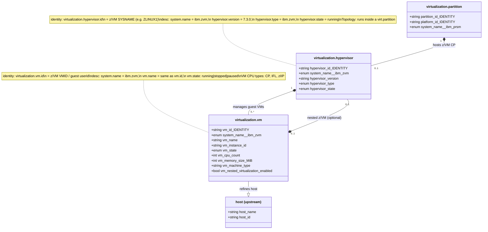
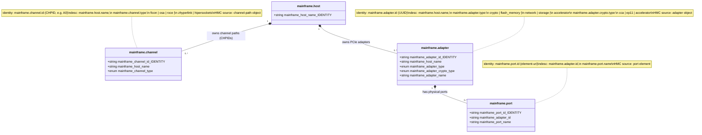
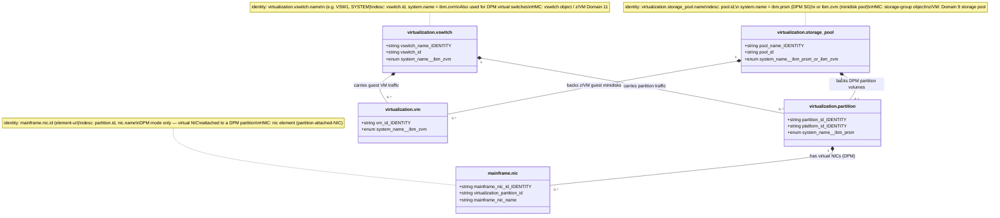
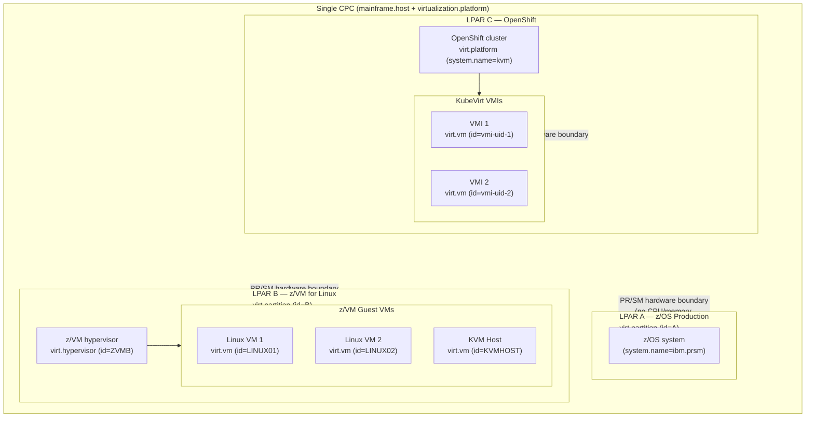
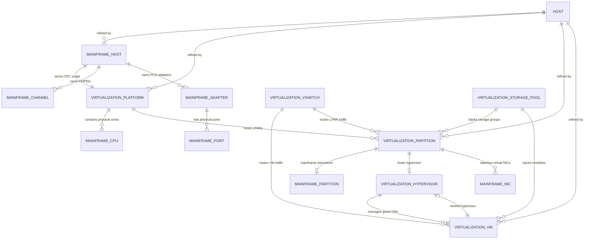

# Mainframe Semantic Conventions — Visual Semantic Models & Architecture

> **Scope:** This document synthesises the entity model, metric associations, and cross-platform
> topology defined in `model/mainframe/` and `model/virtualization/` into modular Mermaid diagrams
> and an executive architecture summary for the IBM Z mainframe observability domain. All entity
> types, attribute keys, and metric names are exact references to the v2 YAML definitions in the
> repository.

---

## 1. Executive Summary

### Design Lessons & Trade-offs

The mainframe semantic conventions answer a single architectural question: *How do we describe
the full IBM Z compute stack — from a physical CPC drawer to a z/VM guest VM — using the same
unified entity model that also covers VMware vSphere, KVM, and OpenShift Virtualization?*

Seven key lessons shaped the final design:

**1. Two entities represent one physical machine.**
The Central Processor Complex (CPC) maps to two overlapping OTel entities: `mainframe.host`
(for environmental, power, and physical hardware metrics) and `virtualization.platform` (for
aggregate CPU, memory, and partition count metrics). Both reference the same CPC via `host.name`.
This dual-binding avoids duplicating physical hardware metrics on the platform entity while keeping
the `system.*` metrics on the standard virtualization entity hierarchy.

**2. `virtualization.partition` fills the firmware-partitioning gap.**
PR/SM Logical Partitions (LPARs) are enforced at the firmware level, not by software. They are
neither VMs (no software hypervisor) nor bare-metal hosts (they share physical hardware within
a sub-millisecond switching boundary). `virtualization.partition` is the entity type that models
this concept precisely, with composite identity (`partition.id` + `platform.id`) to handle
uniqueness within a CPC.

**3. The `ibm.prsm` discriminator enables single-label filtering.**
By setting `virtualization.system.name = "ibm.prsm"` on every PR/SM entity, any PromQL query
can isolate IBM Z PR/SM metrics with `{virtualization_system_name="ibm.prsm"}`. Similarly,
`ibm.zvm` isolates the z/VM layer. This eliminates the need for a separate mainframe entity
type for most queries.

**4. Processor type is a metric attribute, not an entity split.**
IBM Z has six physical processor types (CP, IFL, zIIP, ICF, SAP, IFP) — each assigned to
different workloads. Rather than creating separate entity types per processor type, the model
uses `mainframe.cpu.type` as a discriminating attribute on the `system.cpu.utilization` and
`mainframe.cpu.utilization` metrics. This keeps the entity count minimal while producing the
correct per-type time series.

**5. `mainframe.*` namespace captures what no upstream entity covers.**
Six entity types are genuinely unique to IBM Z infrastructure and have no upstream analogue:
`mainframe.host` (CPC physical hardware), `mainframe.cpu` (individual physical core),
`mainframe.channel` (CHPID I/O channel path), `mainframe.adapter` (crypto/flash/PCIe adapter),
`mainframe.port` (physical adapter port), and `mainframe.nic` (virtual partition-attached NIC).
All other entities reuse upstream `virtualization.*` types with the `ibm.prsm` or `ibm.zvm`
discriminator.

**6. Nested virtualization is an attribute pattern, not a new entity type.**
When z/VM runs inside a PR/SM LPAR, the model uses `virtualization.partition` for the LPAR
and `virtualization.hypervisor` for the z/VM CP instance — both referencing the same
`mainframe.host` via parent attribute traversal. No new entity type is needed for the nested
configuration. Correlate layers with `mainframe.host.name` as a shared resource attribute.

**7. 94 metrics, 11 entity types, minimal duplication.**
The complete mainframe model uses 24 base metric associations, 18 existing virtualization metric
refinements, 14 new mainframe-specific refinements, and 38 net-new `mainframe.*` metrics —
spread across 11 entity types. Every metric definition traces to exactly one target entity; no
metric is duplicated across entity types unless the physical signal genuinely occurs on multiple
resource layers.

---

## 2. CEC, LPAR & Partitioning ERD

The first diagram shows the physical CPC and firmware partitioning entities, including their
identity attributes, descriptive attributes, and `host` entity refinement lineage.

**Notes:**
- `[identity]` marks attributes in the entity `identity:` block — these uniquely identify an instance.
- `mf_host` and `virt_platform` represent the **same physical CPC** but serve different consumers:
  `mf_host` anchors environmental and hardware metrics; `virt_platform` anchors OS-level and
  partition management metrics.
- `virtualization.partition` uses composite identity (`partition.id` + `platform.id`) because
  LPAR numbers (1–64) are only unique within a single CPC.
- `mainframe.partition` is a specialised entity that only carries IBM Z-specific metrics not
  present in the generic `virtualization.partition` schema.

---

## 3. Hypervisor & Guest VM ERD

The second diagram shows the z/VM hypervisor layer and its guest VM entities.

**Notes:**
- z/VM always runs **inside** a `virtualization.partition`. The `virt_hypervisor` entity
  does not exist independently — it is anchored to the LPAR that hosts it.
- Guest VMs (`virtualization.vm`) are z/VM User Directory entries identified by their
  8-character userid (e.g., `LINUX01`). This userid is the stable, unique identity.
- Nested virtualization: z/VM supports running a second z/VM instance inside a guest VM.
  In this case, the inner z/VM appears as a `virtualization.vm` to the outer z/VM, and its
  own `virtualization.hypervisor` entity represents the nested CP instance.
- KVM on IBM Z uses `virtualization.vm.id` from `virDomainGetUUIDString()` and
  `virtualization.system.name = "kvm"`.

---

## 4. Channel, Adapter & Crypto Hardware ERD

The third diagram shows the physical I/O hardware entities: channel paths, hardware adapters,
and their specialisations for crypto and AI acceleration.

**Channel type reference (`mainframe.channel.type`):**

| Enum Value | Full Name | Description |
|---|---|---|
| `ficon` | FICON / ESCON | Fibre Channel Connection for DASD and tape storage (IBM Z primary storage fabric) |
| `osa` | OSA-Express | Open Systems Adapter — Ethernet (GbE / 25GbE / OSD) for TCP/IP networking |
| `roce` | RoCE Express | RDMA over Converged Ethernet — high-throughput 25/100 GbE PCIe network adapter |
| `zhyperlink` | zHyperLink | PCIe synchronous coupling channel for ultra-low latency (<20 µs) Coupling Facility access |
| `hipersockets` | HiperSockets | Internal LAN fabric for zero-copy memory-to-memory transfers between LPARs |

**Adapter type reference (`mainframe.adapter.type`):**

| Enum Value | Description |
|---|---|
| `crypto` | Crypto Express CEX8S/CEX9S hardware security module (HSM). Sub-types: `cca`, `ep11`, `accelerator` |
| `flash_memory` | PCIe Flash Memory (Storage Class Memory / Virtual Flash Memory) for z/OS expanded storage |
| `network` | OSA-Express, RoCE Express, or ISM (Internal Shared Memory) network adapters |
| `storage` | FICON-attached storage controllers, NVMe adapters, FCP HBAs |
| `accelerator` | Neural Network Processing Assist (NNPA) on-chip AI inference accelerator (Telum/Telum-II) |

---

## 5. Network & Storage Virtualization ERD

The fourth diagram shows virtual networking and storage entities for both PR/SM (DPM) and z/VM
layers.

**Storage pool discriminator (`virtualization.system.name`):**

| Value | Context | Storage Construct |
|---|---|---|
| `ibm.prsm` | HMC DPM mode | DPM Storage Group (NVMe, FICON, FCP SAN attached volumes) |
| `ibm.zvm` | z/VM | Named minidisk pool or DASD volume group (Domain 9 records) |

---

## 6. Full Metric-to-Entity Association Map

This diagram shows all mainframe entity types and their complete bound metric sets, organised
by metric source class:
- **A** = `system.*` or `hw.*` base metric associations (from upstream registry)
- **ER** = `existing_virt_refinement` (already defined in `model/virtualization/`)
- **MR** = `new_mf_refinement` (base metric extended with mainframe-specific attributes)
- **NN** = net-new `mainframe.*` metrics

---

## 7. Cross-Platform Topology Lineage

This diagram shows how each IBM Z virtualization layer maps its native constructs into the
unified OTel mainframe/virtualization entity schema. All paths converge on the same entity types
and the same metric definitions — discriminated by `virtualization.system.name`.

```mermaid
flowchart TD
    subgraph Physical ["L0 — Physical Infrastructure"]
        CPC["Central Processor Complex\n(z17 / z16 / z15 CEC frame)"]
        CHPID["Channel Paths (CHPIDs)\nFICON | OSA | RoCE | zHyperLink"]
        ADAPTER["Physical Adapters\nCrypto Express | Flash Memory | RoCE"]
        ENV["Environmental Sensors\nPower | Temperature | Humidity | Heatload"]
    end

    subgraph PRSM_Classic ["L1 — PR/SM Classic Mode"]
        LPAR["Logical Partition (LPAR)\nnamed, processor-type-assigned"]
        POOL["Shared Processor Pool\nCP / IFL / zIIP shared weight pools"]
    end

    subgraph PRSM_DPM ["L1 — PR/SM DPM Mode"]
        DPM_PART["DPM Partition\nresource-profile-based allocation"]
        SG["DPM Storage Group\nNVMe / FICON / FCP SAN"]
        DPM_NIC["Virtual NIC\nattached to DPM partition"]
    end

    subgraph ZVM ["L2 — IBM z/VM Control Program"]
        ZVM_CP["z/VM CP Hypervisor\nSYSNAME-identified instance"]
        GUEST["Guest Virtual Machine\nz/VM User Directory entry (VMID)"]
        VSW["VSWITCH / Guest LAN\nz/VM virtual network switch"]
        MPOOL["Minidisk / DASD Pool\nz/VM named storage pool"]
    end

    subgraph KVM ["L2 — Linux KVM on IBM Z"]
        KVM_HOST["KVM Host (Linux LPAR)\nrunning in a PR/SM partition"]
        KVM_GUEST["KVM Guest VM\nlibvirt domain (virDomain)"]
        KVM_NET["Linux Bridge / macvtap\nvirtual network"]
    end

    subgraph OCP ["L2 — OpenShift Virtualization (s390x)"]
        OCP_NODE["OpenShift Worker Node\nLinux on Z s390x"]
        VMI["VirtualMachineInstance\nKubeVirt vmi.metadata.uid"]
        OCP_NS["Namespace ResourceQuota"]
        OCP_NET["OVN-Kubernetes Network"]
    end

    subgraph OTel_Entities ["OTel Semantic Convention Entities"]
        direction TB
        E_HOST["mainframe.host\nidentity: mainframe.host.name\nsystem discriminator: —"]
        E_PLAT["virtualization.platform\nidentity: host.name\nsystem.name: ibm.prsm"]
        E_PART["virtualization.partition\nidentity: partition.id + platform.id\nsystem.name: ibm.prsm"]
        E_MF_PART["mainframe.partition\nidentity: mainframe.partition.id"]
        E_CHAN["mainframe.channel\nidentity: mainframe.channel.id (CHPID)"]
        E_ADAPT["mainframe.adapter\nidentity: mainframe.adapter.id (UUID)"]
        E_PORT["mainframe.port\nidentity: mainframe.port.id"]
        E_NIC["mainframe.nic\nidentity: mainframe.nic.id"]
        E_HYP["virtualization.hypervisor\nidentity: hypervisor.id (SYSNAME)\nsystem.name: ibm.zvm"]
        E_VM["virtualization.vm\nidentity: vm.id\nsystem.name: ibm.zvm / kvm / ocp_virt"]
        E_VSW["virtualization.vswitch\nidentity: vswitch.name\nsystem.name: ibm.zvm"]
        E_POOL["virtualization.storage_pool\nidentity: pool.name\nsystem.name: ibm.prsm / ibm.zvm"]
    end

    %% Physical layer mappings
    CPC  -->|"mainframe.host.name = CPC.name\nhost.type = machine-type"| E_HOST
    CPC  -->|"host.name = CPC.name\nsystem.name = ibm.prsm"| E_PLAT
    CHPID -->|"channel.id = CHPID\nchannel.type = ficon|osa|roce|…"| E_CHAN
    ADAPTER -->|"adapter.id = object-uri UUID\nadapter.type = crypto|flash|network|…"| E_ADAPT
    ADAPTER -->|"port.id = element-uri"| E_PORT

    %% PR/SM Classic mode mappings
    LPAR  -->|"partition.id = LPAR UUID\nplatform.id = CPC UUID\nsystem.name = ibm.prsm"| E_PART
    LPAR  -->|"partition.id = LPAR UUID\n(IBM Z-specific reserved CPU metrics)"| E_MF_PART
    POOL  -->|"pool.name = shared pool name\nsystem.name = ibm.prsm"| E_POOL

    %% PR/SM DPM mode mappings
    DPM_PART -->|"partition.id = partition UUID\nsystem.name = ibm.prsm"| E_PART
    SG       -->|"pool.name = storage group name\nsystem.name = ibm.prsm"| E_POOL
    DPM_NIC  -->|"nic.id = NIC element-uri\npartition.id = parent partition"| E_NIC

    %% z/VM layer mappings
    ZVM_CP -->|"hypervisor.id = SYSNAME\nhypervisor.version = 7.3.0\nsystem.name = ibm.zvm"| E_HYP
    GUEST  -->|"vm.id = VMID (userid)\nvm.name = VMID\nsystem.name = ibm.zvm"| E_VM
    VSW    -->|"vswitch.name = VSW_NAME\nsystem.name = ibm.zvm"| E_VSW
    MPOOL  -->|"pool.name = POOL_NAME\nsystem.name = ibm.zvm"| E_POOL

    %% KVM layer mappings
    KVM_HOST  -->|"host.name = virConnectGetHostname()\nsystem.name = kvm"| E_PLAT
    KVM_GUEST -->|"vm.id = virDomainGetUUIDString()\nsystem.name = kvm"| E_VM
    KVM_NET   -->|"vswitch.name = virNetworkGetName()\nsystem.name = kvm"| E_VSW

    %% OpenShift Virtualization mappings
    OCP_NODE -->|"host.name = node.metadata.name\nsystem.name = kvm"| E_PLAT
    VMI      -->|"vm.id = vmi.metadata.uid\nsystem.name = openshift_virtualization"| E_VM
    OCP_NS   -->|"pool.name = namespace.name\nsystem.name = openshift_virtualization"| E_POOL
    OCP_NET  -->|"vswitch.name = network.name\nsystem.name = openshift_virtualization"| E_VSW
```

---

## 8. IBM Z Processor Type Dimension

The `mainframe.cpu.type` attribute is the primary IBM Z-specific dimension across processor
metrics. It appears in two refinements and one net-new metric:

```mermaid
classDiagram
    class M_cpu_util["system.cpu.utilization"] {
        <<MR mainframe refinement>>
        +instrument gauge
        +unit 1
        +dim mainframe_cpu_type
        +dim mainframe_cpu_sharing_mode
    }
    class M_cpu_time["system.cpu.time"] {
        <<MR mainframe refinement>>
        +instrument counter
        +unit s
        +dim mainframe_cpu_type
    }
    class M_cpu_core["mainframe.cpu.utilization"] {
        <<NN net-new>>
        +instrument gauge
        +unit 1
        +identity mainframe_cpu_id
    }
    class M_cpu_thread["mainframe.cpu.thread.utilization"] {
        <<NN net-new>>
        +instrument gauge
        +unit 1
        +identity mainframe_cpu_id
        +dim mainframe_cpu_thread_id
    }

    class CpuType["mainframe.cpu.type enum"] {
        <<attribute enum>>
        +cp General Purpose
        +ifl Integrated Facility for Linux
        +ziip Z Integrated Info Processor
        +icf Internal Coupling Facility
        +sap System Assist Processor
        +ifp Integrated Firmware Processor
    }

    note for M_cpu_util "entity: virtualization.platform\nHMC: cpc-usage-overview\n  processor-usage-ifl|cp|ziip|icf\n15-second interval, ratio 0.0–1.0"
    note for M_cpu_time "entity: virtualization.platform\nHMC: cpc-usage-overview\n  processor-time-ifl|cp|ziip|icf\ncumulative ms → s"
    note for M_cpu_core "entity: mainframe.cpu\nHMC: zcpc-processor-usage\n  per individual physical/logical core\nfrom Hardware Instrumentation Services (HIS)"
    note for M_cpu_thread "entity: mainframe.cpu\nHMC: zcpc-processor-usage\n  thread-0-utilization | thread-1-utilization\nSMT-2: each core has 2 threads"

    M_cpu_util  -- CpuType : discriminates by
    M_cpu_time  -- CpuType : discriminates by
    M_cpu_core  -- CpuType : described by
    M_cpu_thread -- CpuType : described by
```

**Processor type reference:**

| `mainframe.cpu.type` | Full Name | Primary Workload | Licensed Separately? |
|---|---|---|---|
| `cp` | Central Processor (General Purpose) | z/OS transaction, batch, all workloads | Yes (MLC, sub-capacity) |
| `ifl` | Integrated Facility for Linux | Linux on Z, z/VM, Java | Yes (flat fee, cheaper) |
| `ziip` | IBM Z Integrated Information Processor | z/OS offload: Java, XML, REST, SSL | Yes (eligible z/OS work) |
| `icf` | Internal Coupling Facility | Parallel Sysplex Coupling Facility workloads | Yes (per ICF engine) |
| `sap` | System Assist Processor | I/O channel operations (invisible to workloads) | No (included in CPC) |
| `ifp` | Integrated Firmware Processor | PCIe subsystem management | No (included in CPC) |

---

## 9. Entity Identity & Discriminator Reference

| Entity Type | Identity Attributes | `virtualization.system.name` Values | Source |
|---|---|---|---|
| `mainframe.host` | `mainframe.host.name` | *not applicable* | HMC CPC object `name` |
| `virtualization.platform` | `host.name` | `ibm.prsm` | HMC CPC object `name` |
| `virtualization.partition` | `virtualization.partition.id` + `virtualization.platform.id` | `ibm.prsm` | HMC LPAR / partition `object-uri` UUID |
| `mainframe.partition` | `mainframe.partition.id` | *not applicable* | HMC LPAR `object-uri` UUID |
| `mainframe.cpu` | `mainframe.cpu.id` | *not applicable* | HIS per-core identifier |
| `virtualization.hypervisor` | `virtualization.hypervisor.id` | `ibm.zvm` | z/VM SYSNAME (Domain 1 / `SYSNAME`) |
| `virtualization.vm` | `virtualization.vm.id` | `ibm.zvm`, `kvm`, `openshift_virtualization` | z/VM VMID; KVM virDomainGetUUIDString() |
| `mainframe.channel` | `mainframe.channel.id` | *not applicable* | HMC channel-path `channel-path-id` (CHPID) |
| `mainframe.adapter` | `mainframe.adapter.id` | *not applicable* | HMC adapter `object-uri` UUID |
| `mainframe.port` | `mainframe.port.id` | *not applicable* | HMC port `element-uri` |
| `mainframe.nic` | `mainframe.nic.id` | *not applicable* | HMC NIC `element-uri` |
| `virtualization.vswitch` | `virtualization.vswitch.name` | `ibm.zvm` | z/VM `VSW_NAME` (Domain 11) |
| `virtualization.storage_pool` | `virtualization.storage_pool.name` | `ibm.prsm`, `ibm.zvm` | HMC storage group `name`; z/VM `POOL_NAME` |

---

## 10. Multi-Tenant Isolation Patterns

IBM Z PR/SM provides hardware-enforced multi-tenant isolation at the firmware level, which has
specific implications for the observability entity model:

**Isolation properties visible in the entity model:**

| Boundary | OTel Entity Relationship | Query Pattern |
|---|---|---|
| CPC → LPAR | `virtualization.platform` → `virtualization.partition` | `{virtualization_platform_id="CPC-UUID"}` |
| LPAR → z/VM CP | `virtualization.partition` → `virtualization.hypervisor` | `{virtualization_hypervisor_id="SYSNAME"}` |
| z/VM CP → Guest | `virtualization.hypervisor` → `virtualization.vm` | `{virtualization_system_name="ibm.zvm", vm_id="LINUX01"}` |
| LPAR → KVM Host | `virtualization.partition` → `virtualization.platform` (KVM) | `{virtualization_system_name="kvm"}` |
| KVM → VMI | `virtualization.platform` (KVM) → `virtualization.vm` | `{virtualization_system_name="openshift_virtualization"}` |

---

## 11. Minimal Slide-Ready ERD (Entities & Relationships Only)

A clean, compact entity-relationship chart optimized for high-legibility presentation slides, containing only entity nodes and their relational cardinality across the mainframe and virtualization hierarchy without attribute bodies:

