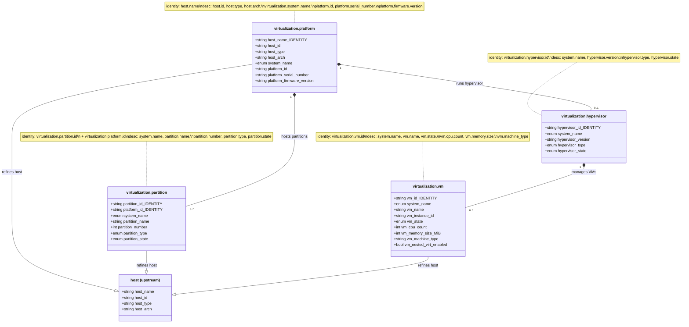
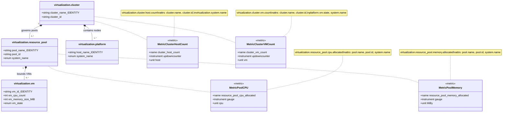
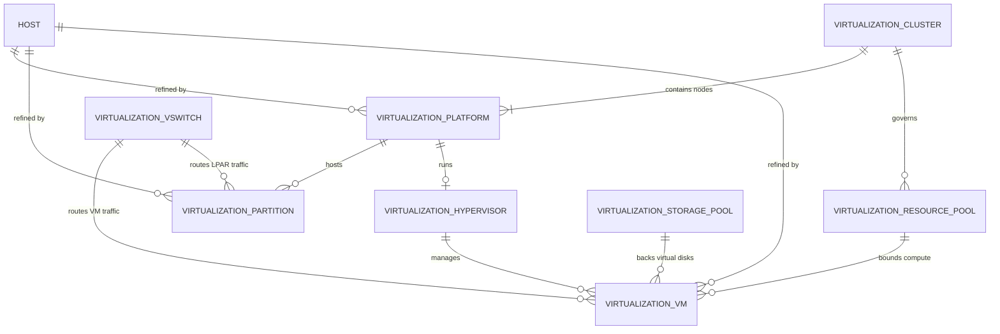

# Virtualization Semantic Conventions — Visual Semantic Models & Architecture

> **Scope:** This document synthesises the entity model, metric associations, and cross-platform
> topology defined in `model/virtualization/` into modular Mermaid diagrams and an executive
> architecture summary. All entity types, attribute keys, and metric names are exact references to
> the v2 YAML definitions in the repository.

---

## 1. Executive Summary

### Design Lessons & Trade-offs

The virtualization semantic conventions were designed to answer a single architectural question:
*How do we describe the full compute stack — from bare metal to VM — using a single, unified entity
model that works across IBM Z PR/SM, IBM z/VM, VMware vSphere, KVM/libvirt, and OpenShift
Virtualization?*

Five key lessons shaped the final design:

**1. Minimal entity types, maximal attribute discrimination.**
Rather than creating a separate entity type per hypervisor platform, the model uses eight entity
types plus the `virtualization.system.name` enum to discriminate platforms. This keeps PromQL
queries simple: `{virtualization_system_name="ibm.prsm"}` isolates all IBM Z PR/SM metrics with a
single label filter.

**2. The `host` refinement pattern eliminates metric duplication.**
`virtualization.platform`, `virtualization.partition`, and `virtualization.vm` each declare an
`entity_refinements:` entry that refines the upstream `host` entity. This means every upstream
`system.*` metric is automatically available on these entities without re-declaring the metric in
the local registry. Only metrics that need an additional discriminating attribute (e.g.,
`virtualization.partition.cpu.type` for IBM Z processor specialisation) require an explicit
`metric_refinements:` block.

**3. `virtualization.partition` fills the firmware-partitioning gap.**
IBM Z PR/SM logical partitions are enforced at the firmware level, not by a software hypervisor.
They are neither VMs (no hypervisor software) nor bare-metal hosts (they share physical hardware).
`virtualization.partition` is the entity type that models this concept; it can coexist with
`virtualization.vm` in the same registry for mixed environments where IBM z/VM runs on top of an
LPAR.

**4. Counter-based latency enables average derivation.**
`virtualization.vm.disk.latency.time` (unit: `s`, instrument: counter) accumulates total wall-clock
time spent in I/O. Dividing `rate(latency_time)` by `rate(disk_operations)` yields average
round-trip latency in seconds per operation — without transmitting histograms or requiring
high-frequency sampling.

**5. Dual-lineage is an attribute, not an entity.**
OpenShift Virtualization VMIs have both a virtualization identity and a Kubernetes identity. Rather
than introducing a new entity type, the model uses `virtualization.vm.node.name` (and
`k8s.namespace.name` as an external attribute) to carry the Kubernetes correlation metadata. The
`virtualization.vm` entity remains the primary anchor; Kubernetes attributes are carried alongside
as resource attributes.

---

## 2. Compute & Partitioning ERD

The first diagram shows the four entities involved in compute and workload isolation, including
their identity attributes, descriptive attributes, and `host` entity refinement lineage.



**Notes:**
- `[identity]` marks attributes in the entity `identity:` block — these uniquely identify an instance.
- Attributes without `[identity]` are in the `description:` block.
- The `--|>` arrows indicate `entity_refinements:` (is-a, not inheritance in the OOP sense).
- `virtualization.partition` uses a two-attribute composite identity (`partition.id` + `platform.id`), because partition IDs are only unique within a platform.

---

## 3. Cluster & Resource Governance ERD

The second diagram shows the cluster and resource governance entities and their containment
relationships.



**Platform-specific notes:**

| Entity | IBM Z PR/SM | VMware vSphere | KVM/oVirt | OpenShift Virt |
|---|---|---|---|---|
| `virtualization.cluster` | HMC management domain | ClusterComputeResource MoRef | oVirt Cluster / Proxmox Cluster | OpenShift Cluster |
| `virtualization.resource_pool` | Shared Processor Pool | vSphere ResourcePool MoRef | cgroup v2 pool | K8s Namespace ResourceQuota |

---

## 4. Storage & Memory Architecture ERD

The third diagram shows the storage pool entity, its relationship to VMs, and the memory management
signals including ballooning and swap.

```mermaid
classDiagram
    class virt_storage_pool["virtualization.storage_pool"] {
        +string pool_name_IDENTITY
        +string pool_id
        +enum system_name
    }

    class virt_vm["virtualization.vm"] {
        +string vm_id_IDENTITY
        +int vm_memory_size_MiB
    }

    class MetricStorageUsed {
        <<metric>>
        +name storage_pool_capacity_used
        +instrument gauge
        +unit By
    }

    class MetricStorageAvail {
        <<metric>>
        +name storage_pool_capacity_available
        +instrument gauge
        +unit By
    }

    class MetricDiskIO {
        <<metric>>
        +name vm_disk_io
        +instrument counter
        +unit By
        +dim disk_direction
    }

    class MetricDiskOps {
        <<metric>>
        +name vm_disk_operations
        +instrument counter
        +unit operation
        +dim disk_direction
    }

    class MetricDiskLatency {
        <<metric>>
        +name vm_disk_latency_time
        +instrument counter
        +unit s
        +dim disk_direction
    }

    class MetricDiskErrors {
        <<metric>>
        +name vm_disk_errors
        +instrument counter
        +unit error
    }

    class MetricMemAlloc {
        <<metric>>
        +name vm_memory_allocated
        +instrument gauge
        +unit MiBy
    }

    class MetricMemUsed {
        <<metric>>
        +name vm_memory_used
        +instrument gauge
        +unit MiBy
    }

    class MetricMemBalloon {
        <<metric>>
        +name vm_memory_balloon
        +instrument gauge
        +unit MiBy
    }

    class MetricMemSwapped {
        <<metric>>
        +name vm_memory_swapped
        +instrument gauge
        +unit MiBy
    }

    class MetricMemRSS {
        <<metric>>
        +name vm_memory_rss
        +instrument gauge
        +unit MiBy
    }

    note for MetricStorageUsed "virtualization.storage_pool.capacity.used\nattrs: pool.name, pool.id, system.name"
    note for MetricStorageAvail "virtualization.storage_pool.capacity.available\nattrs: pool.name, pool.id, system.name"
    note for MetricDiskIO "virtualization.vm.disk.io\nattrs: vm.id, vm.disk.name\ndim: vm.disk.direction = read|write"
    note for MetricDiskOps "virtualization.vm.disk.operations\nattrs: vm.id, vm.disk.name\ndim: vm.disk.direction = read|write"
    note for MetricDiskLatency "virtualization.vm.disk.latency.time\nAvg latency = rate(latency) / rate(ops)\nattrs: vm.id, vm.disk.name\ndim: vm.disk.direction = read|write"
    note for MetricDiskErrors "virtualization.vm.disk.errors\nattrs: vm.id, vm.disk.name"
    note for MetricMemAlloc "virtualization.vm.memory.allocated\nhypervisor-visible RAM (balloon-adjusted)"
    note for MetricMemUsed "virtualization.vm.memory.used\nguest active memory = allocated minus usable"
    note for MetricMemBalloon "virtualization.vm.memory.balloon\nNon-zero = host reclaiming guest memory"
    note for MetricMemSwapped "virtualization.vm.memory.swapped\nbytes in hypervisor swap space"
    note for MetricMemRSS "virtualization.vm.memory.rss\nphysical host pages (KVM and KubeVirt only)\nattrs: vm.id, vm.node.name"

    %% Containment
    virt_storage_pool "1" *-- "0..*" virt_vm : backs virtual disks

    %% Storage pool metrics
    virt_storage_pool .. MetricStorageUsed
    virt_storage_pool .. MetricStorageAvail

    %% VM disk metrics
    virt_vm .. MetricDiskIO
    virt_vm .. MetricDiskOps
    virt_vm .. MetricDiskLatency
    virt_vm .. MetricDiskErrors

    %% VM memory metrics
    virt_vm .. MetricMemAlloc
    virt_vm .. MetricMemUsed
    virt_vm .. MetricMemBalloon
    virt_vm .. MetricMemSwapped
    virt_vm .. MetricMemRSS
```



**Memory signal semantics:**

```
virtualization.vm.memory.allocated      = hypervisor-visible RAM (balloon-adjusted)
│
├── virtualization.vm.memory.used       = active guest memory (allocated − usable)
├── virtualization.vm.memory.balloon    = memory reclaimed by balloon driver (host pressure)
├── virtualization.vm.memory.swapped    = memory swapped to hypervisor swap space
└── virtualization.vm.memory.rss        = physical host pages backing this VM (KVM/KubeVirt only)
```

---

## 5. Virtual Networking & Fabric ERD

The fourth diagram shows the virtual switch entity, its physical NIC uplinks, and VM/partition
network attachments.

```mermaid
classDiagram
    class virt_vswitch["virtualization.vswitch"] {
        +string vswitch_name_IDENTITY
        +string vswitch_id
        +enum system_name
    }

    class virt_vm["virtualization.vm"] {
        +string vm_id_IDENTITY
        +string vm_network_interface_name
    }

    class virt_partition["virtualization.partition"] {
        +string partition_id_IDENTITY
    }

    class MetricNetIO {
        <<metric>>
        +name system_network_io
        +instrument counter
        +unit By
        +dim network_io_direction
    }

    class MetricNetDropped {
        <<metric>>
        +name system_network_packet_dropped
        +instrument counter
        +unit packet
        +dim network_io_direction
    }

    class MetricNetErrors {
        <<metric>>
        +name system_network_errors
        +instrument counter
        +unit error
        +dim network_io_direction
    }

    class MetricHWNetIO {
        <<metric>>
        +name hw_network_io
        +instrument counter
        +unit By
        +dim network_io_direction
    }

    class MetricHWNetBandwidth {
        <<metric>>
        +name hw_network_bandwidth_utilization
        +instrument gauge
        +unit ratio
    }

    class MetricVMNetIO {
        <<metric>>
        +name vm_network_io
        +instrument counter
        +unit By
        +dim network_io_direction
    }

    note for MetricNetIO "system.network.io (refined)\nrefinement.virtualization.system.network.io\nattrs: network.interface.name,\nnetwork.io.direction,\nvirtualization.vswitch.name (opt-in)"
    note for MetricNetDropped "system.network.packet.dropped (refined)\nrefinement.virtualization.system.network.packet.dropped\nattrs: interface.name, direction, vswitch.name"
    note for MetricNetErrors "system.network.errors (refined)\nrefinement.virtualization.system.network.errors\nattrs: interface.name, direction, vswitch.name"
    note for MetricHWNetIO "hw.network.io (refined)\nrefinement.virtualization.hw.network.io\nattrs: vswitch.name, hw.id, hw.name, direction"
    note for MetricHWNetBandwidth "hw.network.bandwidth.utilization (refined)\nrefinement.virtualization.hw.network.bandwidth.utilization\nattrs: vswitch.name, hw.id, hw.name"
    note for MetricVMNetIO "virtualization.vm.network.io\nattrs: vm.id, vm.network.interface.name,\nnetwork.io.direction"

    %% Connectivity
    virt_vswitch "1" *-- "0..*" virt_vm : carries traffic for VMs
    virt_vswitch "1" *-- "0..*" virt_partition : carries traffic for partitions

    %% vswitch hw metrics
    virt_vswitch .. MetricHWNetIO
    virt_vswitch .. MetricHWNetBandwidth

    %% VM network metrics
    virt_vm .. MetricNetIO
    virt_vm .. MetricNetDropped
    virt_vm .. MetricNetErrors
    virt_vm .. MetricVMNetIO

    %% Partition network metrics
    virt_partition .. MetricNetIO
    virt_partition .. MetricNetDropped
    virt_partition .. MetricNetErrors
```



---

## 6. Full Metric-to-Entity Association Map

The following diagram shows all eight entity types and their complete bound metric sets, organised by
metric source class (A = `system.*` refinements, B = `container.*` refinements, C = `hw.*`
refinements, NN = net-new `virtualization.*` metrics).

```mermaid
classDiagram
    %% ── Entities ──────────────────────────────────────────────────────────
    class virt_platform["virtualization.platform"] {
        +string host_name_IDENTITY
    }
    class virt_partition["virtualization.partition"] {
        +string partition_id_IDENTITY
        +string platform_id_IDENTITY
    }
    class virt_hypervisor["virtualization.hypervisor"] {
        +string hypervisor_id_IDENTITY
    }
    class virt_vm["virtualization.vm"] {
        +string vm_id_IDENTITY
    }
    class virt_cluster["virtualization.cluster"] {
        +string cluster_name_IDENTITY
    }
    class virt_resource_pool["virtualization.resource_pool"] {
        +string pool_name_IDENTITY
    }
    class virt_vswitch["virtualization.vswitch"] {
        +string vswitch_name_IDENTITY
    }
    class virt_storage_pool["virtualization.storage_pool"] {
        +string pool_name_IDENTITY
    }

    %% ── Class A — system.* refinements ────────────────────────────────────
    class A_cpu_time["system.cpu.time"] {
        <<Class A refinement>>
        +instrument counter
        +unit s
    }
    class A_cpu_util["system.cpu.utilization"] {
        <<Class A refinement>>
        +instrument gauge
        +unit ratio
    }
    class A_disk_limit["system.disk.limit"] {
        <<Class A refinement>>
        +instrument updowncounter
        +unit By
    }
    class A_net_io["system.network.io"] {
        <<Class A refinement>>
        +instrument counter
        +unit By
    }
    class A_net_dropped["system.network.packet.dropped"] {
        <<Class A refinement>>
        +instrument counter
        +unit packet
    }
    class A_net_count["system.network.packet.count"] {
        <<Class A refinement>>
        +instrument counter
        +unit packet
    }
    class A_net_errors["system.network.errors"] {
        <<Class A refinement>>
        +instrument counter
        +unit error
    }

    note for A_cpu_time "refinement.virtualization.system.cpu.time\nadds: virtualization.partition.cpu.type (opt-in)"
    note for A_cpu_util "refinement.virtualization.system.cpu.utilization\nadds: virtualization.partition.cpu.type (opt-in)"
    note for A_disk_limit "refinement.virtualization.system.disk.limit\nadds: virtualization.storage_pool.name (opt-in)"
    note for A_net_io "refinement.virtualization.system.network.io\nadds: virtualization.vswitch.name (opt-in)"
    note for A_net_dropped "refinement.virtualization.system.network.packet.dropped\nadds: virtualization.vswitch.name (opt-in)"
    note for A_net_count "refinement.virtualization.system.network.packet.count\nadds: virtualization.vswitch.name (opt-in)"
    note for A_net_errors "refinement.virtualization.system.network.errors\nadds: virtualization.vswitch.name (opt-in)"

    %% ── Class B — container.* refinements re-anchored on vm ──────────────
    class B_uptime["container.uptime"] {
        <<Class B refinement>>
        +instrument gauge
        +unit s
    }
    class B_cpu["container.cpu.time / cpu.usage"] {
        <<Class B refinement>>
        +instrument counter_gauge
        +unit s_cpu
    }
    class B_memory["container.memory.*"] {
        <<Class B refinement>>
        +instrument gauge
        +unit By
    }
    class B_disk_net["container.disk.io / network.io / filesystem.*"] {
        <<Class B refinement>>
        +instrument counter
        +unit By
    }

    note for B_uptime "refinement.virtualization.container.uptime\nre-anchors container.uptime on virtualization.vm"
    note for B_cpu "refinement.virtualization.container.cpu.time\nrefinement.virtualization.container.cpu.usage\nadds: virtualization.vm.id (required)"
    note for B_memory "refinement.virtualization.container.memory.usage\n.available / .rss / .working_set / .paging.faults\nadds: virtualization.vm.id (required)"
    note for B_disk_net "refinement.virtualization.container.disk.io\n.network.io / .filesystem.*\nadds: virtualization.vm.id (required)"

    %% ── Class C — hw.* refinements ────────────────────────────────────────
    class C_host_env["hw.host.energy / power / temp / margin"] {
        <<Class C refinement>>
        +instrument gauge
        +unit J_W_Cel
    }
    class C_hw_component["hw.energy / power / errors / status"] {
        <<Class C refinement>>
        +instrument gauge_counter
        +unit J_W_error
    }
    class C_hw_net["hw.network.io / packets / bandwidth / up"] {
        <<Class C refinement>>
        +instrument counter_gauge
        +unit By_packet_ratio
    }

    note for C_host_env "refinement.virtualization.hw.host.energy\n.hw.host.power / .ambient_temperature / .heating_margin\nanchor: host.name (required)"
    note for C_hw_component "refinement.virtualization.hw.energy\n.hw.power / .hw.errors / .hw.status\nanchor: host.name + hw.type (required)"
    note for C_hw_net "refinement.virtualization.hw.network.io\n.packets / .bandwidth.limit / .bandwidth.utilization / .up\nanchor: virtualization.vswitch.name (required)"

    %% ── Net-new virtualization.* metrics ──────────────────────────────────
    class NN_platform["platform metrics"] {
        <<net-new>>
        +cpu_utilization gauge
        +memory_total_used gauge
        +vm_count updowncounter
        +partition_count updowncounter
        +power_usage gauge
    }
    class NN_partition["partition metrics"] {
        <<net-new>>
        +cpu_utilization gauge
        +cpu_count updowncounter
        +memory_size gauge
        +state_code gauge
    }
    class NN_vm["vm metrics"] {
        <<net-new>>
        +cpu_utilization_ready_steal gauge
        +cpu_count updowncounter
        +memory_allocated_used_balloon gauge
        +disk_io_ops_latency_errors counter
        +network_io counter
        +power_state gauge
    }
    class NN_cluster["cluster metrics"] {
        <<net-new>>
        +host_count updowncounter
        +vm_count updowncounter
    }
    class NN_pool["resource pool metrics"] {
        <<net-new>>
        +cpu_allocated gauge
        +memory_allocated gauge
    }
    class NN_storage["storage pool metrics"] {
        <<net-new>>
        +capacity_used gauge
        +capacity_available gauge
    }
    class NN_hypervisor["hypervisor metrics"] {
        <<net-new>>
        +memory_overcommit_ratio gauge
    }

    note for NN_platform "virtualization.platform.cpu.utilization\n.memory.total / .memory.used\n.vm.count / .partition.count\n.power.usage"
    note for NN_partition "virtualization.partition.cpu.utilization\n.cpu.count / .memory.size / .state.code"
    note for NN_vm "virtualization.vm.cpu.utilization / .ready_time / .steal_time / .count\n.memory.allocated / .used / .balloon / .swapped / .rss\n.disk.io / .operations / .latency.time / .errors\n.network.io / .power.state"
    note for NN_cluster "virtualization.cluster.host.count\n.vm.count"
    note for NN_pool "virtualization.resource_pool.cpu.allocated\n.memory.allocated"
    note for NN_storage "virtualization.storage_pool.capacity.used\n.capacity.available"
    note for NN_hypervisor "virtualization.hypervisor.memory.overcommit_ratio"

    %% ── Associations ───────────────────────────────────────────────────────
    virt_platform  .. A_cpu_time
    virt_partition .. A_cpu_time
    virt_vm        .. A_cpu_time

    virt_platform  .. A_cpu_util
    virt_partition .. A_cpu_util
    virt_vm        .. A_cpu_util

    virt_platform    .. A_disk_limit
    virt_storage_pool .. A_disk_limit

    virt_partition .. A_net_io
    virt_vm        .. A_net_io
    virt_vswitch   .. A_net_io

    virt_partition .. A_net_dropped
    virt_vm        .. A_net_dropped
    virt_vswitch   .. A_net_dropped

    virt_partition .. A_net_count
    virt_vm        .. A_net_count
    virt_vswitch   .. A_net_count

    virt_partition .. A_net_errors
    virt_vm        .. A_net_errors
    virt_vswitch   .. A_net_errors

    virt_vm .. B_uptime
    virt_vm .. B_cpu
    virt_vm .. B_memory
    virt_vm .. B_disk_net

    virt_platform .. C_host_env
    virt_platform .. C_hw_component
    virt_vswitch  .. C_hw_net

    virt_platform  .. NN_platform
    virt_partition .. NN_partition
    virt_vm        .. NN_vm
    virt_cluster   .. NN_cluster
    virt_resource_pool .. NN_pool
    virt_storage_pool  .. NN_storage
    virt_hypervisor    .. NN_hypervisor
```



---

## 7. Cross-Platform Topology Lineage

This diagram shows how each major enterprise virtualization platform maps its native constructs into
the single unified OTel virtualization schema. All paths converge on the same eight entity types and
the same `model/virtualization/` metric definitions.

```mermaid
flowchart TD
    subgraph IBM_Z_PRSM ["IBM Z — PR/SM (Classic Mode)"]
        Z1["CPC\n(Central Processing Complex)"]
        Z2["LPAR\n(Logical Partition)"]
        Z3["Shared Processor Pool"]
        Z4["Storage Group\n(DPM Storage)"]
    end

    subgraph IBM_Z_ZVM ["IBM Z — z/VM"]
        ZV1["z/VM Hypervisor Instance"]
        ZV2["z/VM Guest\n(Virtual Machine)"]
        ZV3["VSWITCH\n(z/VM Virtual Switch)"]
    end

    subgraph VMware ["VMware vSphere / ESXi"]
        VS1["ESXi Host\n(HostSystem)"]
        VS2["Virtual Machine\n(VirtualMachine)"]
        VS3["Resource Pool\n(ResourcePool MoRef)"]
        VS4["Datastore\n(Datastore MoRef)"]
        VS5["Cluster\n(ClusterComputeResource)"]
        VS6["dvSwitch\n(DistributedVirtualSwitch)"]
    end

    subgraph KVM_libvirt ["KVM / libvirt"]
        KV1["Linux KVM Host\n(virNodeInfo)"]
        KV2["libvirt Domain\n(virDomain)"]
        KV3["libvirt Network\n(virNetwork / Linux Bridge)"]
        KV4["libvirt Storage Pool\n(virStoragePool)"]
        KV5["libvirt Daemon\n(virtqemud)"]
    end

    subgraph OCP_Virt ["OpenShift Virtualization / KubeVirt"]
        OC1["OpenShift Worker Node\n(k8s.node.name)"]
        OC2["VirtualMachineInstance\n(vmi.metadata.uid)"]
        OC3["K8s Namespace ResourceQuota"]
        OC4["PVC / StorageClass\n(CSI pool)"]
        OC5["OpenShift Cluster"]
        OC6["virt-handler DaemonSet"]
        OC7["OVN-Kubernetes Network"]
    end

    subgraph OTel_Entities ["OTel Virtualization Entities\n(model/virtualization/)"]
        direction TB
        E1["virtualization.platform\nsystem.name: ibm.prsm / kvm / vmware.esxi"]
        E2["virtualization.partition\nsystem.name: ibm.prsm"]
        E3["virtualization.hypervisor\nsystem.name: ibm.zvm / kvm / openshift_virtualization"]
        E4["virtualization.vm\nsystem.name: ibm.zvm / kvm / vmware.esxi / openshift_virtualization"]
        E5["virtualization.cluster"]
        E6["virtualization.resource_pool\nsystem.name: ibm.prsm / vmware.esxi / openshift_virtualization"]
        E7["virtualization.vswitch\nsystem.name: ibm.zvm / kvm / vmware.esxi"]
        E8["virtualization.storage_pool\nsystem.name: ibm.prsm / vmware.esxi / kvm / openshift_virtualization"]
    end

    %% IBM Z PR/SM mappings
    Z1  -->|host.name = CPC name\nsystem.name = ibm.prsm| E1
    Z2  -->|partition.id = LPAR object-id\nplatform.id = CPC object-id| E2
    Z3  -->|pool.name = shared pool name\nsystem.name = ibm.prsm| E6
    Z4  -->|pool.name = storage group name\nsystem.name = ibm.prsm| E8

    %% IBM z/VM mappings
    ZV1 -->|hypervisor.id = z/VM UUID\nsystem.name = ibm.zvm| E3
    ZV2 -->|vm.id = guest UUID\nsystem.name = ibm.zvm| E4
    ZV3 -->|vswitch.name = VSWITCH name\nsystem.name = ibm.zvm| E7

    %% VMware vSphere mappings
    VS1 -->|host.name = ESXi hostname\nsystem.name = vmware.esxi| E1
    VS2 -->|vm.id = VirtualMachine.config.uuid\nsystem.name = vmware.esxi| E4
    VS3 -->|pool.name = ResourcePool.name\nsystem.name = vmware.esxi| E6
    VS4 -->|pool.name = Datastore.name\nsystem.name = vmware.esxi| E8
    VS5 -->|cluster.name = ClusterComputeResource.name| E5
    VS6 -->|vswitch.name = dvSwitch.name\nsystem.name = vmware.esxi| E7

    %% KVM / libvirt mappings
    KV1 -->|host.name = virConnectGetHostname()\nsystem.name = kvm| E1
    KV2 -->|vm.id = virDomainGetUUIDString()\nsystem.name = kvm| E4
    KV3 -->|vswitch.name = virNetworkGetName()\nsystem.name = kvm| E7
    KV4 -->|pool.name = virStoragePoolGetName()\nsystem.name = kvm| E8
    KV5 -->|hypervisor.id = kvm://hostname\nsystem.name = kvm| E3

    %% OpenShift Virtualization mappings
    OC1 -->|host.name = node.metadata.name\nsystem.name = kvm| E1
    OC2 -->|vm.id = vmi.metadata.uid\nsystem.name = openshift_virtualization| E4
    OC3 -->|pool.name = namespace.name\nsystem.name = openshift_virtualization| E6
    OC4 -->|pool.name = StorageClass.name\nsystem.name = openshift_virtualization| E8
    OC5 -->|cluster.name = cluster.spec.clusterID| E5
    OC6 -->|hypervisor.id = virt-handler:node-name\nsystem.name = openshift_virtualization| E3
    OC7 -->|vswitch.name = network.name\nsystem.name = openshift_virtualization| E7
```

---

## 8. Entity Identity & Discriminator Reference

| Entity Type | Identity Attributes | `virtualization.system.name` values | Notes |
|---|---|---|---|
| `virtualization.platform` | `host.name` | `ibm.prsm`, `kvm`, `vmware.esxi`, `ibm.powervm`, `hyperv` | Platform-level: physical host |
| `virtualization.partition` | `virtualization.partition.id` + `virtualization.platform.id` | `ibm.prsm` | Composite identity — unique within the platform |
| `virtualization.hypervisor` | `virtualization.hypervisor.id` | `ibm.zvm`, `kvm`, `openshift_virtualization`, `vmware.esxi` | Software hypervisor layer |
| `virtualization.vm` | `virtualization.vm.id` | `ibm.zvm`, `kvm`, `vmware.esxi`, `openshift_virtualization`, `kubevirt`, `hyperv`, `xen` | Full UUID uniquely identifies the VM |
| `virtualization.cluster` | `virtualization.cluster.name` | any | Cluster MoRef or management domain name |
| `virtualization.resource_pool` | `virtualization.resource_pool.name` | `ibm.prsm`, `vmware.esxi`, `openshift_virtualization` | Processor pool, ResourcePool, or Namespace ResourceQuota |
| `virtualization.vswitch` | `virtualization.vswitch.name` | `ibm.zvm`, `kvm`, `vmware.esxi`, `openshift_virtualization` | VSWITCH name, dvSwitch name, Linux bridge name |
| `virtualization.storage_pool` | `virtualization.storage_pool.name` | `ibm.prsm`, `vmware.esxi`, `kvm`, `openshift_virtualization` | Datastore MoRef, libvirt pool, StorageClass |

---

## 9. `virtualization.partition.cpu.type` Attribute Dimension

The `virtualization.partition.cpu.type` attribute is the primary IBM Z-specific dimension in the
virtualization metrics. It is used in two refinements and two net-new metrics:

```mermaid
classDiagram
    %% ── Metrics that carry this dimension ─────────────────────────────────
    class M_cpu_time["system.cpu.time"] {
        <<Class A refinement>>
        +instrument counter
        +unit s
        +dim partition_cpu_type
    }
    class M_cpu_util["system.cpu.utilization"] {
        <<Class A refinement>>
        +instrument gauge
        +unit ratio
        +dim partition_cpu_type
    }
    class M_part_util["virtualization.partition.cpu.utilization"] {
        <<net-new>>
        +instrument gauge
        +unit ratio
        +dim partition_cpu_type
    }
    class M_part_count["virtualization.partition.cpu.count"] {
        <<net-new>>
        +instrument updowncounter
        +unit vcpu
        +dim partition_cpu_type
    }

    note for M_cpu_time "entities: platform, partition, vm\nrefinement.virtualization.system.cpu.time\ncpu.type is opt-in"
    note for M_cpu_util "entities: platform, partition, vm\nrefinement.virtualization.system.cpu.utilization\ncpu.type is opt-in"
    note for M_part_util "entity: partition\nrequirement_level: recommended"
    note for M_part_count "entity: partition\nrequirement_level: recommended"

    %% ── Enum values of virtualization.partition.cpu.type ──────────────────
    class cpu_type_cp["cp"] {
        <<enum value>>
        +desc Central Processor
    }
    class cpu_type_ifl["ifl"] {
        <<enum value>>
        +desc Integrated Facility for Linux
    }
    class cpu_type_icf["icf"] {
        <<enum value>>
        +desc Internal Coupling Facility
    }
    class cpu_type_iip["iip"] {
        <<enum value>>
        +desc z Integrated Information Processor
    }
    class cpu_type_cbp["cbp"] {
        <<enum value>>
        +desc Coupling Bus Processor
    }
    class cpu_type_aap["aap"] {
        <<enum value>>
        +desc Application Assist Processor
    }
    class cpu_type_all["all"] {
        <<enum value>>
        +desc aggregate across all types
    }
    class cpu_type_unknown["unknown"] {
        <<enum value>>
        +desc platform not differentiated
    }

    note for cpu_type_cp "General-purpose IBM Z processor"
    note for cpu_type_ifl "Linux-optimised specialty engine"
    note for cpu_type_icf "Sysplex coupling specialty engine"
    note for cpu_type_iip "Java / DB2 eligible specialty engine"
    note for cpu_type_cbp "HiperSockets coupling bus processor"
    note for cpu_type_aap "zAAP — deprecated in z13 and later"
    note for cpu_type_all "Omit cpu.type to get aggregate"
    note for cpu_type_unknown "Non-IBM Z platforms or undifferentiated"

    %% ── Each metric is split by every enum value ──────────────────────────
    M_cpu_time  .. cpu_type_cp
    M_cpu_time  .. cpu_type_ifl
    M_cpu_time  .. cpu_type_icf
    M_cpu_time  .. cpu_type_iip
    M_cpu_time  .. cpu_type_cbp
    M_cpu_time  .. cpu_type_aap
    M_cpu_time  .. cpu_type_all
    M_cpu_time  .. cpu_type_unknown

    M_cpu_util  .. cpu_type_cp
    M_cpu_util  .. cpu_type_ifl
    M_cpu_util  .. cpu_type_icf
    M_cpu_util  .. cpu_type_iip
    M_cpu_util  .. cpu_type_cbp
    M_cpu_util  .. cpu_type_aap
    M_cpu_util  .. cpu_type_all
    M_cpu_util  .. cpu_type_unknown

    M_part_util  .. cpu_type_cp
    M_part_util  .. cpu_type_ifl
    M_part_util  .. cpu_type_icf
    M_part_util  .. cpu_type_iip
    M_part_util  .. cpu_type_cbp
    M_part_util  .. cpu_type_aap
    M_part_util  .. cpu_type_all
    M_part_util  .. cpu_type_unknown

    M_part_count .. cpu_type_cp
    M_part_count .. cpu_type_ifl
    M_part_count .. cpu_type_icf
    M_part_count .. cpu_type_iip
    M_part_count .. cpu_type_cbp
    M_part_count .. cpu_type_aap
    M_part_count .. cpu_type_all
    M_part_count .. cpu_type_unknown
```



On non-IBM Z platforms (VMware, KVM, OpenShift Virt), `virtualization.partition.cpu.type` is
omitted from metric data points or set to `unknown`. This allows unified dashboards to work across
platforms while still providing IBM Z-specific CPU specialisation breakdowns when the platform is
IBM Z.

---

## 10. `vm.disk.direction` Splitting Pattern

The disk I/O metrics use a common `virtualization.vm.disk.direction` attribute to split read and
write measurements into separate time series:

```mermaid
classDiagram
    %% ── Enum values ───────────────────────────────────────────────────────
    class dir_read["read"] {
        <<enum value>>
        +desc data read from virtual disk
    }
    class dir_write["write"] {
        <<enum value>>
        +desc data written to virtual disk
    }

    %% ── Metrics split by this dimension ───────────────────────────────────
    class M_disk_io["virtualization.vm.disk.io"] {
        <<net-new>>
        +instrument counter
        +unit By
        +dim disk_direction_required
    }
    class M_disk_ops["virtualization.vm.disk.operations"] {
        <<net-new>>
        +instrument counter
        +unit operation
        +dim disk_direction_required
    }
    class M_disk_lat["virtualization.vm.disk.latency.time"] {
        <<net-new>>
        +instrument counter
        +unit s
        +dim disk_direction_required
    }
    class M_disk_err["virtualization.vm.disk.errors"] {
        <<net-new>>
        +instrument counter
        +unit error
        +dim disk_direction_recommended
    }

    note for M_disk_io "virtualization.vm.disk.io\nattrs: vm.id, vm.disk.name\nrequirement_level: required"
    note for M_disk_ops "virtualization.vm.disk.operations\nattrs: vm.id, vm.disk.name\nrequirement_level: required"
    note for M_disk_lat "virtualization.vm.disk.latency.time\nAttrs: vm.id, vm.disk.name\nAvg latency = rate(latency_s) / rate(ops)\nrequirement_level: required"
    note for M_disk_err "virtualization.vm.disk.errors\nattrs: vm.id, vm.disk.name\nrequirement_level: recommended"

    %% ── Each metric is split by read and write ────────────────────────────
    dir_read  .. M_disk_io
    dir_write .. M_disk_io

    dir_read  .. M_disk_ops
    dir_write .. M_disk_ops

    dir_read  .. M_disk_lat
    dir_write .. M_disk_lat

    dir_read  .. M_disk_err
    dir_write .. M_disk_err
```



---

## 11. Multi-tenant Isolation Patterns

When deploying virtualization observability in multi-tenant environments, use the following attribute
filters to isolate telemetry by platform and tenant:

| Isolation dimension | Prometheus label filter | OTel attribute |
|---|---|---|
| IBM Z PR/SM only | `{virtualization_system_name="ibm.prsm"}` | `virtualization.system.name` |
| IBM z/VM guests only | `{virtualization_system_name="ibm.zvm"}` | `virtualization.system.name` |
| VMware ESXi only | `{virtualization_system_name="vmware.esxi"}` | `virtualization.system.name` |
| KVM VMs only | `{virtualization_system_name="kvm"}` | `virtualization.system.name` |
| OpenShift VMs only | `{virtualization_system_name="openshift_virtualization"}` | `virtualization.system.name` |
| Single ESXi cluster | `{virtualization_cluster_name="prod-cluster-01"}` | `virtualization.cluster.name` |
| Single CPC (IBM Z) | `{host_name="PROD-Z16"}` | `host.name` |
| Single LPAR | `{virtualization_partition_id="<uuid>"}` | `virtualization.partition.id` |
| K8s namespace VMs | `{k8s_namespace_name="my-team"}` | `k8s.namespace.name` |
| Specific resource pool | `{virtualization_resource_pool_name="high-priority-pool"}` | `virtualization.resource_pool.name` |

---

## 12. Complete Virtualization Entity-Relationship Diagram (Slide-Ready)

The following comprehensive ERD visualises all 8 `virtualization.*` entities along with their identity (`PK`) and descriptive attributes, refinement lineages, and structural containment/governance relationships. It is formatted as a self-contained diagram designed for presentation on PowerPoint slides.

```mermaid
erDiagram
    %% ── Upstream base entity ──
    HOST ||--o{ VIRTUALIZATION_PLATFORM : "refined by"
    HOST ||--o{ VIRTUALIZATION_PARTITION : "refined by"
    HOST ||--o{ VIRTUALIZATION_VM : "refined by"

    %% ── Containment & Governance Relationships ──
    VIRTUALIZATION_CLUSTER ||--|{ VIRTUALIZATION_PLATFORM : "contains nodes"
    VIRTUALIZATION_CLUSTER ||--o{ VIRTUALIZATION_RESOURCE_POOL : "governs"
    VIRTUALIZATION_PLATFORM ||--o{ VIRTUALIZATION_PARTITION : "hosts"
    VIRTUALIZATION_PLATFORM ||--o| VIRTUALIZATION_HYPERVISOR : "runs"
    VIRTUALIZATION_HYPERVISOR ||--o{ VIRTUALIZATION_VM : "manages"
    VIRTUALIZATION_RESOURCE_POOL ||--o{ VIRTUALIZATION_VM : "bounds compute"
    VIRTUALIZATION_STORAGE_POOL ||--o{ VIRTUALIZATION_VM : "backs virtual disks"
    VIRTUALIZATION_VSWITCH ||--o{ VIRTUALIZATION_VM : "routes VM traffic"
    VIRTUALIZATION_VSWITCH ||--o{ VIRTUALIZATION_PARTITION : "routes LPAR traffic"

    %% ── Entity Definitions ──
    HOST {
        string host_name PK "Host name"
        string host_id "Host UUID / machine ID"
        string host_type "Machine model / family"
        string host_arch "Architecture (s390x, x86_64, arm64)"
    }

    VIRTUALIZATION_PLATFORM {
        string host_name PK "Physical host identifier (matches host.name)"
        string platform_id "Platform UUID or CPC name"
        string platform_serial_number "Hardware serial number"
        string platform_firmware_version "Driver / firmware level"
        string virtualization_system_name "Discriminator: ibm.prsm, kvm, vmware.esxi, ibm.powervm, hyperv"
    }

    VIRTUALIZATION_CLUSTER {
        string virtualization_cluster_name PK "Cluster name or MoRef"
        string virtualization_cluster_id "Cluster UUID or spec identifier"
        string virtualization_system_name "Discriminator: ibm.prsm, vmware.esxi, openshift_virtualization"
    }

    VIRTUALIZATION_PARTITION {
        string virtualization_partition_id PK "Partition UUID / slot (composite PK)"
        string virtualization_platform_id PK "Platform UUID / CPC identifier (composite PK)"
        string virtualization_partition_name "Partition name (e.g. LPAR name)"
        int virtualization_partition_number "MIF / partition number"
        string virtualization_partition_type "Partition mode (zos, linux, coupling_facility)"
        string virtualization_partition_state "Operating state (active, deactive, check_stop)"
        string virtualization_system_name "Discriminator: ibm.prsm"
    }

    VIRTUALIZATION_HYPERVISOR {
        string virtualization_hypervisor_id PK "Hypervisor node identifier or UUID"
        string virtualization_hypervisor_version "Hypervisor version (e.g. z/VM 7.3, ESXi 8.0)"
        string virtualization_hypervisor_type "Architecture (type_1_bare_metal, type_2_hosted)"
        string virtualization_hypervisor_state "State (running, stopped, maintenance, degraded)"
        string virtualization_system_name "Discriminator: ibm.zvm, kvm, vmware.esxi, openshift_virtualization"
    }

    VIRTUALIZATION_RESOURCE_POOL {
        string virtualization_resource_pool_name PK "Resource pool name or quota identifier"
        string virtualization_resource_pool_id "Resource pool UUID / MoRef"
        string virtualization_system_name "Discriminator: ibm.prsm, vmware.esxi, openshift_virtualization"
    }

    VIRTUALIZATION_STORAGE_POOL {
        string virtualization_storage_pool_name PK "Datastore name, pool name, StorageClass"
        string virtualization_storage_pool_id "Storage pool UUID or MoRef"
        string virtualization_system_name "Discriminator: ibm.prsm, vmware.esxi, kvm, openshift_virtualization"
    }

    VIRTUALIZATION_VSWITCH {
        string virtualization_vswitch_name PK "VSWITCH, dvSwitch, or Linux bridge name"
        string virtualization_vswitch_id "Virtual switch UUID or MoRef"
        string virtualization_system_name "Discriminator: ibm.zvm, kvm, vmware.esxi, openshift_virtualization"
    }

    VIRTUALIZATION_VM {
        string virtualization_vm_id PK "Virtual machine UUID"
        string virtualization_vm_name "Guest display name"
        string virtualization_vm_instance_id "Runtime instance identifier"
        string virtualization_vm_state "Status: running, stopped, paused, suspended, crashed"
        int virtualization_vm_cpu_count "Allocated vCPU count"
        int virtualization_vm_memory_size "Provisioned memory in bytes"
        string virtualization_vm_machine_type "Emulated architecture (s390-virtio, q35, pc)"
        boolean virtualization_vm_nested_virt_enabled "Nested virtualization active"
        string virtualization_system_name "Discriminator: ibm.zvm, kvm, vmware.esxi, openshift_virtualization"
    }
```



---

## 13. Minimal Slide-Ready ERD (Entities & Relationships Only)

A clean, compact entity-relationship chart optimized for high-legibility presentation slides, containing only entity nodes and their relational cardinality without attribute bodies:


